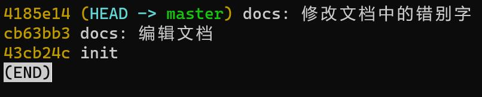

# 常见场景指南

本指南根据规范的约定，设定工作中会出现的场景，并给出操作流程，以此对规范进行补充说明。  

> 本指南不保证解释清楚演示中的每一条命令，有表述不清之处对你造成困扰，请在issue中提出。

## 合并若干个commit

[GIT文档](https://book.git-scm.com/book/zh/v2/Git-%E5%B7%A5%E5%85%B7-%E9%87%8D%E5%86%99%E5%8E%86%E5%8F%B2)

**核心命令**: `git rebase`

**场景一：** 完成了一部分工作并`commit`之后，发现刚刚`commit`的内容存在问题需要修改。  
修改完成之后再一次`commit`，`commit`记录变成了2条。如下图：

实际提交记录中的两条记录属于同一份工作，应该将这两份工作合并为一条记录。

**操作流程：**

- `git rebase -i HEAD~2` ： HEAD指当前分支，`~2`指向上选择2个提交进行调整。
- 将需要合并入上一个`commit`的行标记为`fixup`，并退出编辑
- 最后2个变更将合并为同一个变更

**说明**：重写提交不只能合并提交，还能拆分提交、重新排序、修改提交信息等。更多内容见GIT文档中相关章节。
